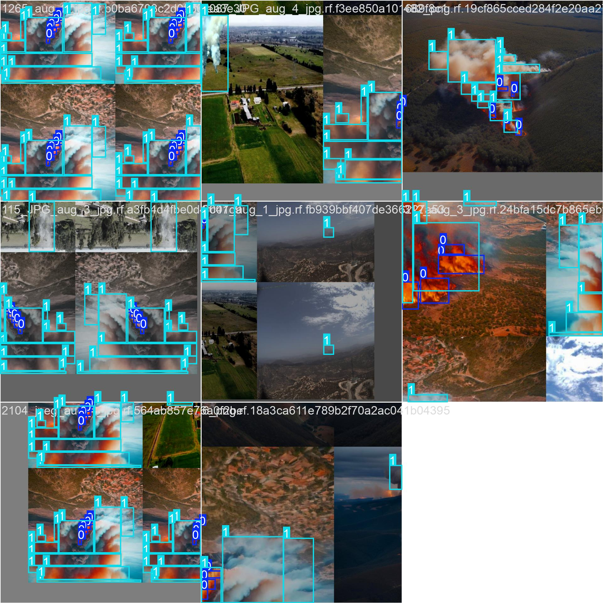

# Detector de Humo con YOLOv11

Proyecto para detectar humo/vapor en tiempo real usando cámara (PC o móvil). Entrenado en Google Colab con un dataset custom de ~500 imágenes (humo real, vapor, falsos positivos como nubes/imágenes impresas). Usa YOLOv11n para eficiencia en edge devices.

  <!-- Sube una img de prueba de tu cámara -->

## Características
- **Detección precisa**: mAP@0.5 = 0.78 (en validación).
- **Tiempo real**: ~20 FPS en CPU estándar.
- **Alertas**: Notifica si 3 frames consecutivos con humo (confianza >0.5).
- **Clases**: 0: `humo` (prioridad), 1: `vapor` (para diferenciar falsos positivos).

## Instalación
1. Clona el repo: `git clone https://github.com/leonardo231520/detector-de-humo.git`
2. Instala dependencias: `pip install -r requirements.txt`
3. (Opcional) Para modelos grandes: `git lfs install` y `git lfs pull`.
4. Verifica: `python --version` (necesitas Python 3.10+).

## Entrenamiento
- Configura tu dataset en `data/data.yaml` (nc: 2, names: ['humo', 'vapor']).
- Corre: `python scripts/train_yolo.py` (usa GPU si tienes: `device=0`).
- Resultados: En `runs/train/weights/best.pt`. Reanuda con `resume=True` usando `weights/last.pt`.

## Prueba en Cámara (PC)
- Corre: `python scripts/prueba_modelo.py`.
- Abre ventana con Matplotlib; apunta la cámara y presiona Ctrl+C para salir.
- Si detecta: Bounding boxes verdes (detección) o rojas (alerta en consola).

## Exportar para Móvil
- Corre: `python scripts/export_onnx.py` → genera `mobile/best.onnx` (~5MB).
- Integra en React Native/Expo: Ver `mobile/DeteccionHumo.js` (usa expo-camera + onnxruntime-react-native).
- Prueba: `npx expo start` en tu app.

## Métricas
Revisa `results/results.csv` para detalles. Resumen de validación final:

| Métrica       | Valor  |
|---------------|--------|
| mAP@0.5      | 0.78  |
| mAP@0.5:0.95 | 0.52  |
| Precision    | 0.82  |
| Recall       | 0.75  |

  <!-- Agrega tus samples seleccionados -->

## Troubleshooting
- **Error cámara**: Chequea permisos en Windows (o usa `cap = cv2.VideoCapture(1)` para otra cam).
- **Bajo FPS**: Baja `imgsz=416` en inferencia.
- **No detecta**: Baja `conf_threshold=0.4` en `prueba_modelo.py`.
- **ONNX error**: Verifica `onnxruntime` versión 1.19+.

## Contribuciones
¡Bienvenidas! Forkea, crea PRs o abre issues. Autor: [Leonardo @ GitHub](https://github.com/leonardo231520).

Licencia: MIT. [LICENSE](LICENSE)